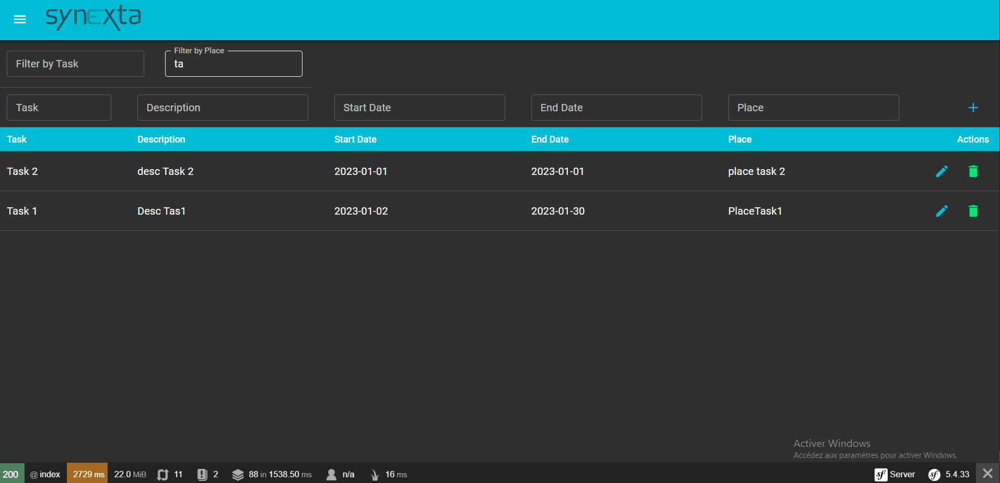

# Synexta_todo

## Description du Projet

This project is a Todo application developed with PHP 8 and Symfony 5.4 for the backend, and React JS for the frontend. The application allows users to manage events, including features such as creating, updating, deleting, and filtering events.

### Prérequis
- Utilisation de PHP 8 minimum
- Utilisation de Symfony 5.4
- 
### Fonctionnalités
- API pour gérer les événements (CRUD).
- Filtrage des événements par date et lieu.
- Validation des données d'entrée.
- Gestion des erreurs.
- Tests unitaires et fonctionnels.


## Structure du Projet

├── backend/ # Code source du backend (Symfony)

├── assets/ # Code source du frontend (React JS)

├── captures/ # Captures d'écran du projet

├── README.txt # Documentation du projet (ce fichier)

├── .env # Configuration des variables d'environnement


## Configuration du Projet

### Backend (Symfony)

1. Assurez-vous d'avoir PHP 8 et Symfony 5.4 installés.
2. Installez les dépendances.

```bash

composer install
php bin/console make:migration
php bin/console doctrine:migrations:migrate
php bin/console server:run

### frontend (React)

1. Assurez-vous d'avoir Node.js et npm installés.
2. Installez les dépendances.

```bash

yarn/npm install


### Technologies Utilisées
- PHP 8
- Symfony 5.4
- SQLite ou MySQL (base de données)
- Doctrine ORM
- Frontend (React JS)
- React (Hooks, Context API)
- Axios (communication avec l'API)
## Captures d'Écran
### Todo_list



